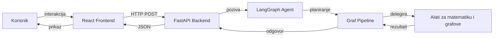
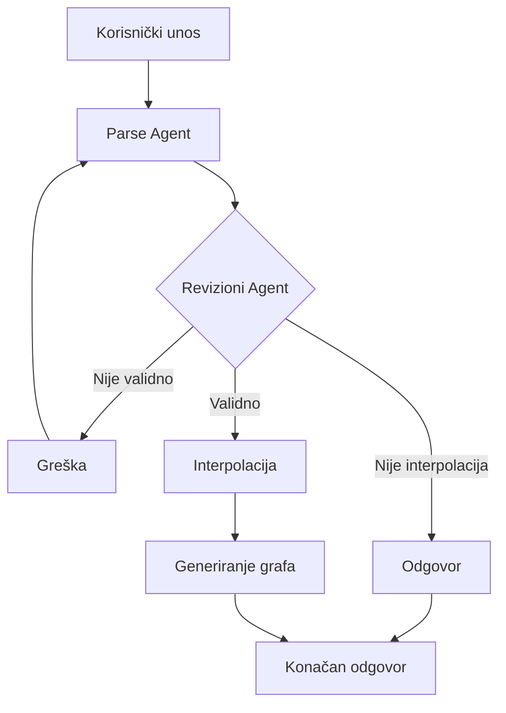

# Interpolator AI

Full-stack aplikacija za numeričku interpolaciju bazirana na LangGraph, FastAPI i React tehnologijama.

## Quick Start

### Preduslovi
*   Instaliran Git
*   Instaliran Docker

### Instalacija i Pokretanje

1.  **Kloniranje repozitorija**
    ```bash
    git clone https://github.com/kadusic1/interpolator-ai
    cd interpolator-ai
    ```

2.  **Konfiguracija**
    Neophodno je napraviti Groq API Key kako bi se mogao pozivati LLM.
    Groq API Key se može napraviti na linku: `https://console.groq.com/keys`

    Kreirajte `.env` datoteku u root direktoriju i dodajte Groq API Key koji:
    ```env
    GROQ_API_KEY=vas_groq_api_key
    ```

3.  **Pokretanje (Docker)**
    Za build process je potrebno između 5 i 10 minuta.

    ```bash
    docker compose up --build
    ```

    Frontend: `http://localhost:5173`
    Backend: `http://localhost:8000`

---

## Arhitektura

Sistem koristi klijent-server arhitekturu gdje LangGraph agent orkestrira matematičke operacije.



## Workflow Agenta

Proces validacije i izvršavanja interpolacijskih zahtjeva.



## Tehnološki Stack

| Komponenta | Tehnologija |
|------------|-------------|
| **Frontend** | React, TypeScript, Vite |
| **Backend** | Python 3.13, FastAPI |
| **Agent** | LangGraph |
| **Package Mgr** | uv |
| **Vizualizacija** | Matplotlib |
