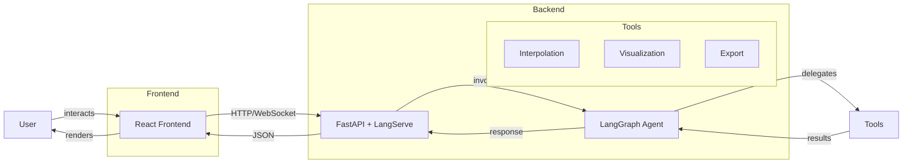
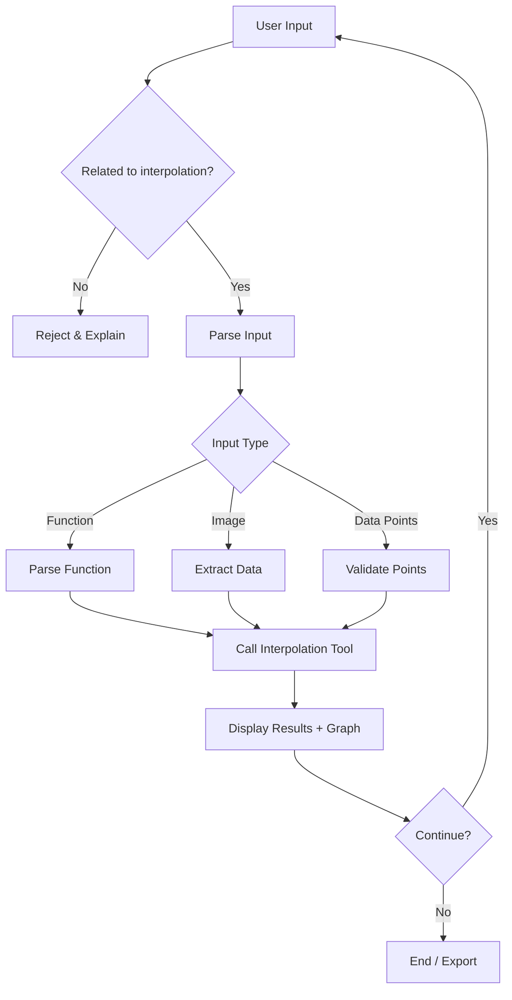

# Agentic Numerical Interpolation

A full-stack chat-based interpolation app powered by LangGraph, FastAPI, and
React.

## Architecture



## Agent Workflow



## Features

| Feature | Description |
|---------|-------------|
| Chat Interface | ChatGPT/Gemini-like experience |
| Input Parsing | Functions, images, raw data |
| Interpolation | Multiple numerical methods |
| Visualization | Interactive graphs |
| Export | PDF / Image output |
| Memory | Session-only (clears on close) |

## Agent Boundaries

| Agent Does | Agent Does NOT |
|------------|----------------|
| Parse user input | Perform calculations |
| Select appropriate tools | Store persistent memory |
| Format & explain results | Handle non-interpolation tasks |
| Route to visualization | Make mathematical decisions |

## Tech Stack

| Layer | Technology |
|-------|------------|
| Frontend | React + TypeScript + Vite |
| API | FastAPI + LangServe |
| Agent | LangGraph |
| Validation | Pydantic |
| Visualization | Matplotlib |

## Quick Start

### Backend

```bash
# Setup virtual environment and install dependencies
python -m venv .venv && source .venv/bin/activate
pip install -r requirements.txt

# Start API server
uvicorn src.api.main:app --reload --port 8000
```

### Frontend

```bash
cd frontend
npm install
npm run dev
```

The frontend runs at `http://localhost:5173` and connects to the API at
`http://localhost:8000`.
